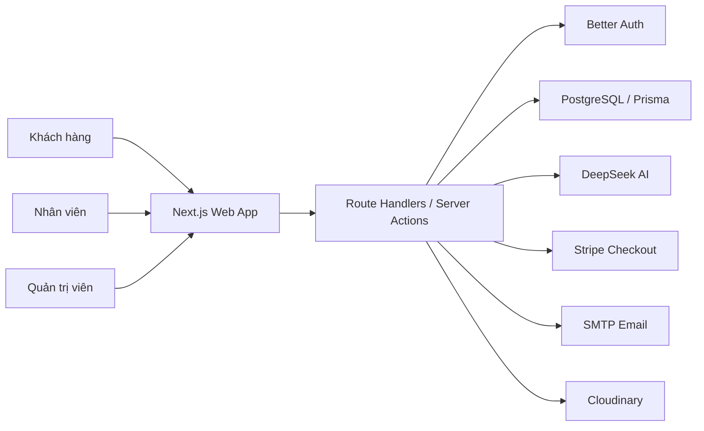

<p align="center">
  
</p>

<h1 align="center">Know — Nền tảng thương mại điện tử laptop</h1>

<p align="center">
  Trải nghiệm tìm kiếm, lựa chọn và mua sắm laptop hiện đại, thông minh và cá nhân hóa.
</p>

<p align="center">
  
  
  
  
  
</p>

## Mục lục

- [Giới thiệu](#giới-thiệu)
- [Chức năng nổi bật](#chức-năng-nổi-bật)
- [Kiến trúc hệ thống](#kiến-trúc-hệ-thống)
- [Công nghệ sử dụng](#công-nghệ-sử-dụng)
- [Cài đặt và cấu hình](#cài-đặt)
- [Khởi tạo cơ sở dữ liệu](#khởi-tạo-cơ-sở-dữ-liệu)
- [Chạy dự án](#chạy-dự-án)
- [Kiểm thử](#kiểm-thử)
- [Cấu trúc thư mục](#cấu-trúc-thư-mục)
- [Thành viên đóng góp](#thành-viên-đóng-góp)
- [Lưu ý bảo mật](#lưu-ý-bảo-mật)

## Giới thiệu

**Know** là nền tảng thương mại điện tử chuyên kinh doanh laptop, được xây dựng nhằm giúp người dùng tìm kiếm, so sánh và lựa chọn sản phẩm phù hợp giữa nhiều thương hiệu, cấu hình và phân khúc giá.

Khác với một website bán hàng thông thường, Know kết hợp dữ liệu hành vi với hệ thống gợi ý cá nhân hóa và chatbot AI để hỗ trợ người dùng trong suốt hành trình mua sắm. Hệ thống đồng thời cung cấp khu vực vận hành riêng cho nhân viên và quản trị viên, từ xử lý đơn hàng, quản lý kho sản phẩm đến theo dõi báo cáo kinh doanh.

### Mục tiêu dự án

- Đơn giản hóa quá trình tìm hiểu và lựa chọn laptop.
- Cá nhân hóa trải nghiệm mua sắm dựa trên nhu cầu của từng người dùng.
- Xây dựng quy trình đặt hàng và thanh toán rõ ràng, an toàn.
- Hỗ trợ cửa hàng quản lý sản phẩm, đơn hàng và khách hàng tập trung.
- Cung cấp dữ liệu thống kê trực quan phục vụ hoạt động vận hành.

## Chức năng nổi bật

### Khách hàng

- Đăng nhập bằng Google hoặc mã OTP gửi qua email.
- Tìm kiếm, lọc và sắp xếp laptop theo danh mục, thương hiệu, giá và thông số kỹ thuật.
- Xem hình ảnh, cấu hình, mã giảm giá và đánh giá của từng sản phẩm.
- So sánh nhiều sản phẩm laptop.
- Quản lý giỏ hàng, danh sách yêu thích và địa chỉ nhận hàng.
- Đặt hàng với hình thức COD hoặc thanh toán trực tuyến qua Stripe.
- Theo dõi trạng thái, xem chi tiết, hủy và thanh toán lại đơn hàng.
- Đánh giá sản phẩm đã mua.
- Nhận gợi ý sản phẩm dựa trên lịch sử tìm kiếm, lượt xem và mua hàng.
- Sử dụng chatbot AI để được tư vấn lựa chọn laptop.

### Nhân viên

- Theo dõi dashboard, doanh thu, đơn hàng và sản phẩm bán chạy.
- Tìm kiếm, lọc và xử lý đơn hàng.
- Cập nhật trạng thái đơn hàng theo đúng quy trình.
- Xem thông tin khách hàng và xuất báo cáo được phân quyền.

### Quản trị viên

- Quản lý sản phẩm, hình ảnh và thông số kỹ thuật.
- Quản lý danh mục, thương hiệu và mã giảm giá.
- Quản lý đánh giá, khách hàng và tài khoản nhân viên.
- Phân quyền, khóa hoặc mở khóa tài khoản.
- Theo dõi báo cáo doanh thu, đơn hàng, tồn kho và khách hàng.

## Kiến trúc hệ thống



Ứng dụng sử dụng kiến trúc module theo nghiệp vụ. Mỗi nhóm chức năng được tách riêng trong `src/features`, trong khi App Router chịu trách nhiệm điều hướng, render phía máy chủ và cung cấp API. Prisma đóng vai trò lớp truy cập dữ liệu thống nhất giữa ứng dụng và PostgreSQL.

## Công nghệ sử dụng

| Thành phần | Công nghệ |
|---|---|
| Frontend | Next.js 16, React 19, TypeScript |
| Giao diện | Tailwind CSS, shadcn/ui, Radix UI, Lucide Icons |
| Quản lý dữ liệu | TanStack Query, Zustand |
| Backend | Next.js App Router và Route Handlers |
| Cơ sở dữ liệu | PostgreSQL, Prisma ORM |
| Xác thực | Better Auth, Google OAuth, Email OTP |
| Thanh toán | Stripe Checkout và Webhook |
| Lưu trữ ảnh | Cloudinary, ảnh cục bộ |
| AI | DeepSeek API, AI SDK |
| Email | Nodemailer, Gmail SMTP |
| Kiểm thử | Vitest, Happy DOM |

## Yêu cầu hệ thống

- Node.js 20 trở lên.
- pnpm 9 trở lên.
- PostgreSQL hoặc một dự án Supabase.
- Tài khoản Google OAuth và SMTP nếu sử dụng đầy đủ chức năng đăng nhập.

## Cài đặt

```bash
git clone https://github.com/kurumi-1006/know-laptop-shop-public.git
cd know-laptop-shop-public
pnpm install
```

Tạo tệp môi trường từ mẫu:

```bash
cp .env.example .env
```

Trên PowerShell:

```powershell
Copy-Item .env.example .env
```

## Cấu hình môi trường

Các nhóm biến môi trường chính:

| Nhóm | Biến cần thiết |
|---|---|
| Cơ sở dữ liệu | `DATABASE_URL`, `DIRECT_URL` |
| Better Auth | `BETTER_AUTH_SECRET`, `BETTER_AUTH_URL` |
| Google OAuth | `GOOGLE_CLIENT_ID`, `GOOGLE_CLIENT_SECRET` |
| Email OTP | `SMTP_USER`, `SMTP_PASSWORD`, `EMAIL_FROM` |
| Supabase | `NEXT_PUBLIC_SUPABASE_URL`, `NEXT_PUBLIC_SUPABASE_ANON_KEY` |
| Stripe | `STRIPE_SECRET_KEY`, `STRIPE_WEBHOOK_SECRET` |
| AI | `DEEPSEEK_API_KEY`, `DEEPSEEK_MODEL`, `DEEPSEEK_BASE_URL` |
| Cloudinary | `NEXT_PUBLIC_CLOUDINARY_CLOUD_NAME`, `CLOUDINARY_API_KEY`, `CLOUDINARY_API_SECRET`, `CLOUDINARY_URL` |

Không commit tệp `.env` hoặc khóa bí mật lên GitHub.

## Khởi tạo cơ sở dữ liệu

Sinh Prisma Client:

```bash
pnpm exec prisma generate
```

Áp dụng migration:

```bash
pnpm exec prisma migrate deploy
```

Nạp dữ liệu mẫu:

```bash
pnpm exec tsx src/prisma/seed.ts
```

Bộ seed hiện cung cấp sản phẩm, ảnh cục bộ, thương hiệu, danh mục, tài khoản mẫu, đơn hàng, đánh giá, mã giảm giá và lịch sử tương tác phục vụ hệ thống gợi ý.

## Chạy dự án

Khởi động môi trường phát triển:

```bash
pnpm dev
```

Truy cập [http://localhost:3000](http://localhost:3000).

Build và chạy bản production:

```bash
pnpm build
pnpm start
```

## Stripe Webhook

Khi phát triển trên máy cá nhân, có thể chuyển tiếp sự kiện Stripe bằng Stripe CLI:

```bash
stripe listen --forward-to localhost:3000/api/payments/stripe/webhook
```

Sao chép webhook signing secret được Stripe CLI cung cấp vào `STRIPE_WEBHOOK_SECRET` trong tệp `.env`.

## Kiểm thử

Chạy toàn bộ test:

```bash
pnpm test
```

Chạy kiểm tra mã nguồn:

```bash
pnpm lint
pnpm exec tsc --noEmit
```

## Cấu trúc thư mục

```text
src/
├── app/                 Trang, layout và API routes
├── components/          Thành phần giao diện dùng chung
├── features/            Các module nghiệp vụ
│   ├── admin/           Quản trị hệ thống
│   ├── auth/            Xác thực và phân quyền
│   ├── cart/            Giỏ hàng
│   ├── chat/            Chatbot AI
│   ├── order/           Đặt hàng và quản lý đơn hàng
│   ├── product/         Sản phẩm và so sánh
│   ├── profile/         Hồ sơ và địa chỉ
│   ├── recommendation/  Gợi ý sản phẩm cá nhân hóa
│   └── wishlist/        Danh sách yêu thích
├── lib/                 Tiện ích và dịch vụ dùng chung
└── prisma/              Schema, migration và seed dữ liệu
```

## Tài khoản và phân quyền

Hệ thống có ba vai trò:

- `customer`: mua hàng và quản lý dữ liệu cá nhân.
- `staff`: xử lý đơn hàng và xem báo cáo được phân quyền.
- `admin`: quản lý toàn bộ dữ liệu và tài khoản hệ thống.

Seed tạo dữ liệu mẫu cho cả ba vai trò. Việc đăng nhập vẫn sử dụng Google OAuth hoặc Email OTP theo cấu hình của môi trường triển khai.

## Thành viên đóng góp

<table>
  <tr>
    <td align="center" width="160">
      <a href="https://github.com/kurumi-1006">
        <br />
        <sub><b>kurumi-1006</b></sub>
      </a>
    </td>
    <td align="center" width="160">
      <a href="https://github.com/B1ue-Dev">
        <br />
        <sub><b>B1ue-Dev</b></sub>
      </a>
    </td>
    <td align="center" width="160">
      <a href="https://github.com/happywei09">
        <br />
        <sub><b>happywei09</b></sub>
      </a>
    </td>
    <td align="center" width="160">
      <a href="https://github.com/ToanPhuc15062005">
        <br />
        <sub><b>ToanPhuc15062005</b></sub>
      </a>
    </td>
  </tr>
</table>

## Lưu ý bảo mật

- Không đưa `.env`, mật khẩu SMTP, API key hoặc private key vào repository.
- Chỉ sử dụng Stripe test mode trong môi trường phát triển.
- Cấu hình đúng callback URL cho Google OAuth và webhook endpoint cho Stripe.
- Thay `BETTER_AUTH_SECRET` bằng chuỗi ngẫu nhiên có độ dài tối thiểu 32 ký tự.
